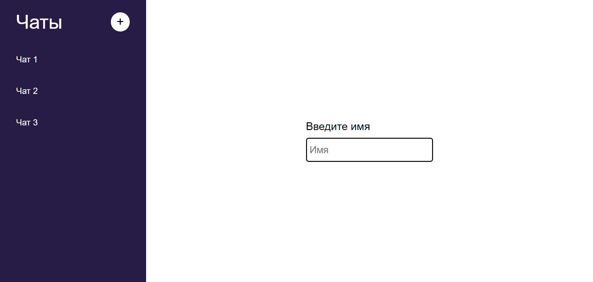
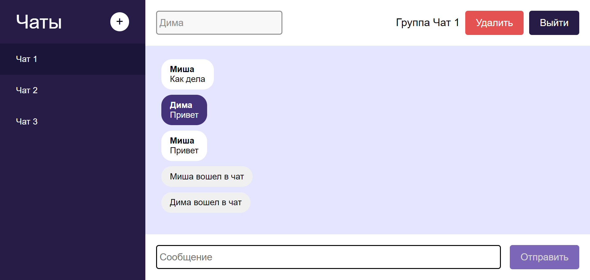
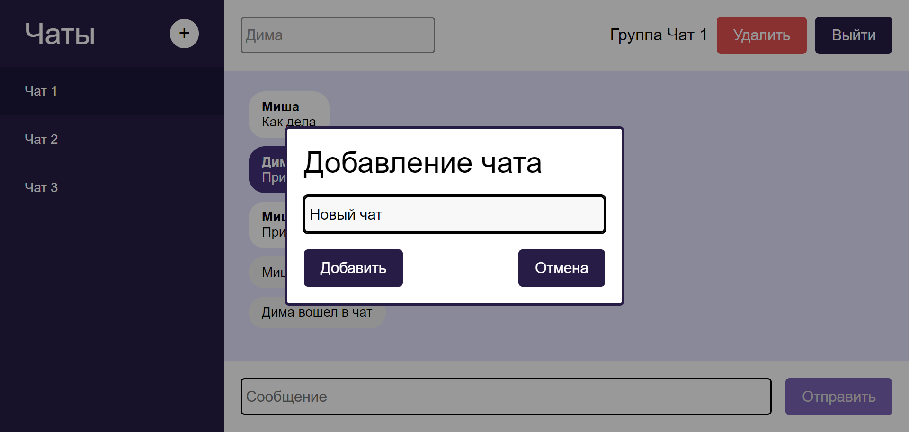
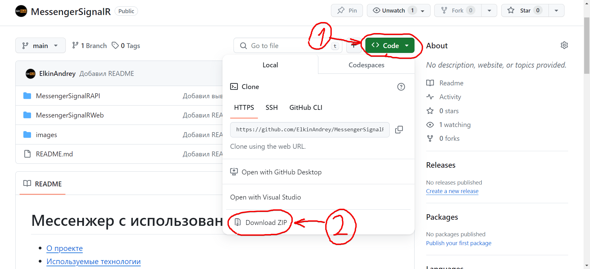
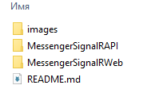
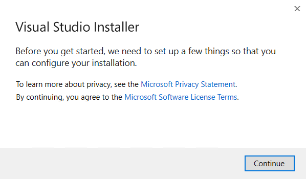
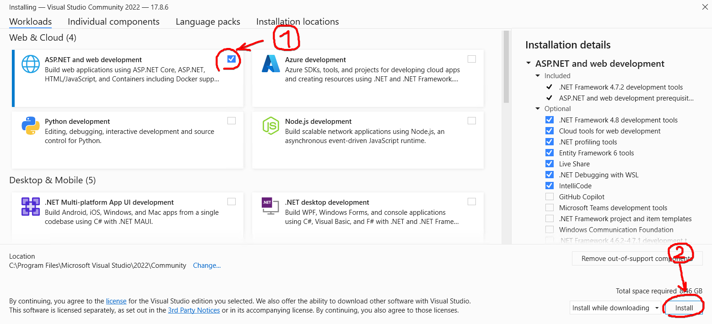
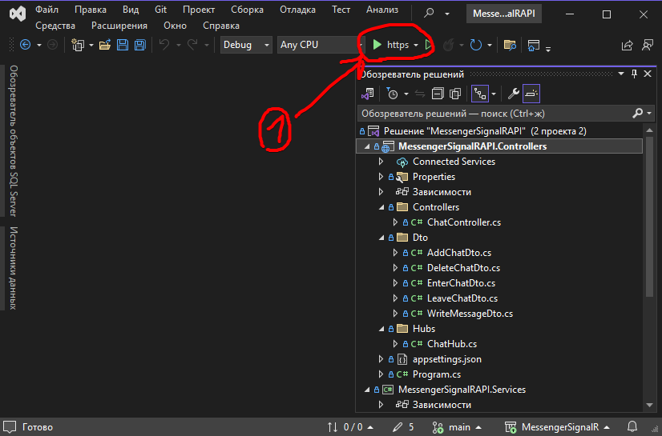
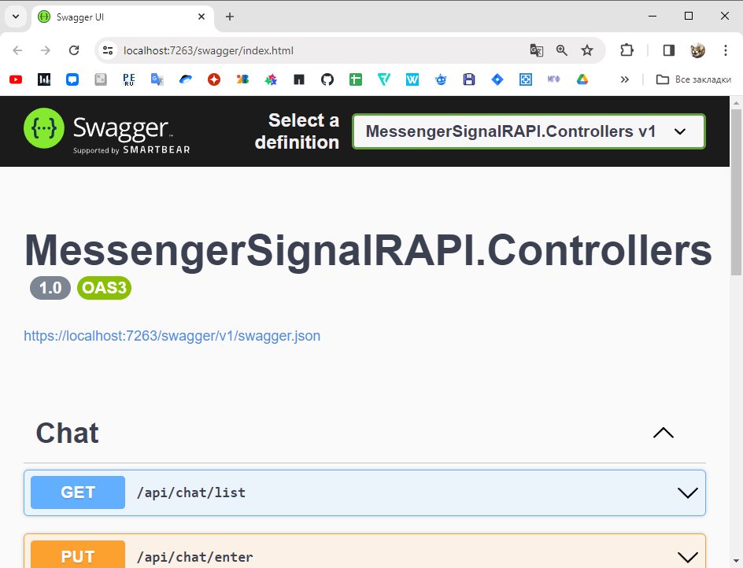
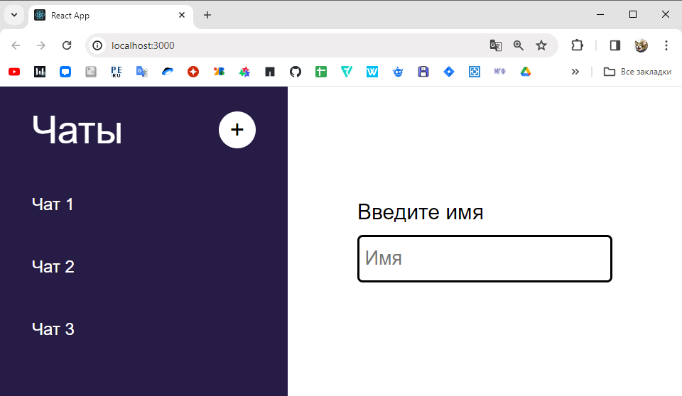

# Мессенжер с использованием SignalR

* [О проекте](#AboutProj)
* [Используемые технологии](#TechUsed)
* [Настройка окружения разработки](#Setting)

## О проекте

Мессенджер, работающий с использованием SignalR. Серверное приложение написано на ASP.NET Core Web Api. Для обмена сообщениями в режиме реального времени используется SignalR. Клиентское веб приложение написано на React. 

После запуска в приложении появится страница с чатами и поле для ввода имени.

После ввода имени и входа в чат, откроется страница чата. На странице есть кнопки для удаления и выхода из чата.

При нажании на кнопку "+" появится модальное окно, где можно добавить новый чат.

Для проверки можно открыть сайт в двух окнах в браузере и зайти в один чат под разными именами.

## Используемые технологии

* Операционная система: Windows 10, версия 22H2 (сборка ОС 19045.3930)

### Сервер

* Язык программирования: C# 
* Версия Visual Studio: Microsoft Visual Studio Community 2022 (64-разрядная версия) - Current Версия 17.8.4
* Версия .net: net8.0
* Тип проекта MessengerSignalRAPI (создан в Visual Studio)
  * MessengerSignalRAPI.Controllers: Веб-API ASP.NET Core (Майкрософт) 
  * MessengerSignalRAPI.Services: Библиотека классов (Майкрософт)

### Клиентское Web приложение 

* Язык программирования: Java Script 
* Версия NodeJS: v20.5.1
* Версия React: 18.2.0

## Настройка окружения разработки

### Загрузка проекта

1. Зайти на GitHub проекта (https://github.com/ElkinAndrey/MessengerSignalR)
2. Нажать кнопку "Code"
3. Нажать кнопку "Download ZIP"

4. Скачать и распаковать архив

### Установка Visual Studio

1. Скачать установщик Visual Studio ()
2. Открыть установщик
3. В открывшемся окне нажать кнопку "Далее"

4. В новом окне нажать галочку у пункта "ASP.NET и разработка веб-приложений"
5. Нажать кнопку "Установить"

### Установка Node JS

1. Скачать установщик Node JS (https://nodejs.org/en/download/)
2. Открыть установщик и нажимать кнопку "Далее", пока Node JS не будет установлен

### Запуск 

1. В каталоге с проектом открыть каталог "MessengerSignalRAPI"
2. В нем должен находится файл "MessengerSignalRAPI.sln", который необходимо открыть при помощи Visual Studio
3. Затем нужно запустить проект в Visual Studio, нажав зеленую кнопку с треугольником (если это первый запускаемй проект, то нужно будет нажать "Ок" на всех открывшехся окнах с разрешениями)

4. Если все сделано правильно, то в браузере откроется окно Swagger, где можно протестировать все конечные точки

5. В каталоге с проектом открыть каталог "MessengerSignalRWeb", в нем должны лежать файлы "package.json" и "package-lock.json"
6. Откройте "Командную строку"  
  6.1. Нажмите сочетание клавиш "Win + R"  
  6.2. В открывшемся окне вбиваете "cmd"  
  6.3. Нажимаете кнопку "Ок"  
7. В консоли перейдите в каталог "MessengerSignalRWeb" (Для смены диска введите команду "D:" где D имя диска, а для перехода по папкам введите команду "cd D:\MessengerSignalRWeb", где "D:\MessengerSignalRWeb" - это путь к папке)
8. После перехода, введите в консоль команду "npm i" для установики всех необходимых библиотек
9. После установки библиотек, введите в консоль команду "npm start" для того, чтобы запустить проект
10. После запуска в браузере откроется окно веб-приложения

